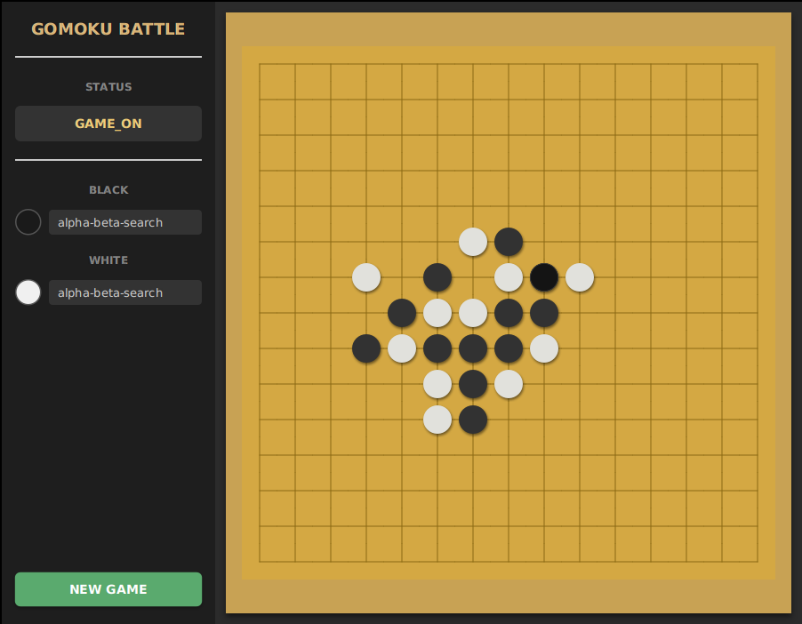

# ♟️ GOMOKU BATTLE

> A cross-language, cross-platform **Gomoku AI battle arena** — pit your own AI agents against each other and watch them fight for five in a row!

## ⚔️ An Example Game between Alpha-Beta-Search Agents
<!---
{"command":"NEXT_WHITE","rows":15,"columns":15,"chessboard":"B[76];W[65];B[55];W[66];B[67];W[58];B[74];W[75];B[57];W[64];B[53];W[54];B[63];W[85];B[95];W[86];B[87];W[97];B[a8];W[43];B[47];W[77];B[46];W[32];B[21];W[37];B[48];W[45];B[4a];W[49];B[35];W[24];B[79];W[68];B[44];W[62];B[26];W[17];B[52];W[99];B[88];W[98];B[9a];W[89];B[41];W[30];B[11];W[31];B[33];W[22];B[16];W[36];B[18];W[7a];B[6b];W[5b];B[29];W[1a];B[3a];W[a7];B[b6];W[5c];B[5a];W[2a];B[4b];W[07];B[3c];W[69];B[3b];W[8b];B[9c];W[3d];B[94];W[83];B[84];W[b7];B[38];W[39];B[c7];W[a4];B[a5];W[d8];B[96];W[b4];B[8d];W[ab];B[d6];W[c6];B[28];W[08];B[93];W[92];B[9e];W[7c];B[2d];W[1e];B[25];W[27];B[9b];W[9d];B[1d];W[2c];B[4e];W[09];B[4c];W[4d];B[a9];W[b8];B[0a];W[a2];B[b2];W[c9];B[a3];W[ba];B[e7];W[bb];B[b9];W[eb];B[da];W[cb];B[db];W[82];B[72];W[06];B[05];W[ca];B[d0];W[c1];B[8e];W[cc];B[6e]"}
-->


## 📊 Dashboard


## 🎯 Overview

**Gomoku** (also called Gobang or Five in a Row) is an abstract strategy board game. Players alternate turns placing a stone of their color on an empty intersection. The winner is the first player to form an unbroken chain of five stones horizontally, vertically, or diagonally. More details on [Wikipedia](https://en.wikipedia.org/wiki/Gomoku).

**Gomoku Battle** is a cross-language, cross-system **battle platform** with pluggable AI agents. Write your own agent in any language, plug it in, and see how it performs!

### Project Modules

| Module | Description |
|--------|-------------|
| **gomoku-battle-core** | Core Gomoku library — board representation, pattern recognition, and game rules |
| **gomoku-battle-console** | The referee — manages agent subprocesses, sends/receives JSON commands |
| **gomoku-battle-dashboard** | Real-time JavaFX dashboard to visualize the game as it unfolds |
| **gomoku-battle-alphabetasearch** | 🏆 **A strong built-in AI agent** powered by alpha-beta pruning (see below) |
| **gomoku-battle-alphazero** | AlphaZero adapter — integrates an MCTS + neural-network based agent via stdio |

---

## 🧠 Alpha-Beta Pruning Agent — The Built-in Champion

The included **Alpha-Beta Search agent** is a highly competitive Gomoku AI. It combines deep search with smart heuristics to play at a strong level:

| Feature | Detail |
|---------|--------|
| **Search Depth** | 7-ply lookahead with alpha-beta pruning for efficient deep search |
| **Move Ordering** | Top 10 candidate moves ranked by heuristic value — dramatically reduces the search tree |
| **Pattern Evaluation** | Recognizes key formations (open fours, open threes, half-open sequences, etc.) with finely tuned scores |
| **Combination Bonuses** | Detects deadly multi-threat combos (e.g., double half-open fours, open three + half-open four) |
| **Search Cache** | 10 million-entry cache with smart invalidation for blazing-fast repeated lookups |
| **Parallel Search** | Multi-threaded candidate evaluation to fully utilize modern multi-core CPUs |

> **Try to beat it — or build an even stronger agent and challenge it on the platform!**

---

## 🚀 Launch Battle Platform
```bash
git clone https://github.com/zhixiangli/gomoku-battle.git
cd gomoku-battle
sh build.sh
sh battle.sh -c battle.properties
```

## ⚙️ Configuration
AI agents can be configured by modifying **battle.properties**:

+ **player.xxxxx.alias**: set an alias for the agent.
+ **player.xxxxx.cmd**: a shell command to start an agent. No agent will start if the command is empty. Every agent should implement the following command.

### Configuration Example
```properties
player.black.cmd=java -jar bin/gomoku-battle-alphabetasearch-0.0.1-SNAPSHOT-jar-with-dependencies.jar
player.black.alias=alpha-beta-search
player.white.cmd=java -jar bin/gomoku-battle-alphabetasearch-0.0.1-SNAPSHOT-jar-with-dependencies.jar
player.white.alias=alpha-beta-search
```

For the AlphaZero adapter, you can pass MCTS settings directly in `player.xxxxx.cmd`, for example: `--simulation-num=5000`.

## 🔌 AI Agent API
The console creates a subprocess for each AI agent. Communication is via **stdin** (JSON request) and **stdout** (JSON response).

### Request

| Field | Description |
|-------|-------------|
| command | `NEXT_BLACK` (next color is black) or `NEXT_WHITE` (next color is white) |
| rows | the number of rows in a chessboard |
| columns | the number of columns in a chessboard |
| chessboard | SGF |

### Sample Request
```json
{"command":"NEXT_BLACK","rows":15,"columns":15,"chessboard":"B[96];W[a5];B[a4];W[95]"}
```

### Response
Return the position to make a move.

### Sample Response
```json
{"rowIndex":3,"columnIndex":10}
```

## 🤖 AI Agent Example

| AI | Description | Language | Command Processor |
|----|-------------|----------|-------------------|
| [alpha-beta-search](https://github.com/zhixiangli/gomoku-battle/tree/master/gomoku-battle-alphabetasearch) | 🏆 Alpha-Beta Search Agent — strong built-in AI | Java | [AlphaBetaSearchAgent.java](https://github.com/zhixiangli/gomoku-battle/blob/master/gomoku-battle-alphabetasearch/src/main/java/com/zhixiangli/gomoku/alphabetasearch/AlphaBetaSearchAgent.java) |
| [alphazero](https://github.com/zhixiangli/gomoku-battle/tree/master/gomoku-battle-alphazero) | AlphaZero Agent adapter with configurable MCTS simulations | Python | [alphazero_adapter.py](https://github.com/zhixiangli/gomoku-battle/blob/master/gomoku-battle-alphazero/alphazero_adapter.py) |
