# ♟️ GOMOKU BATTLE

> A lightweight Gomoku AI arena for running and comparing agents.

## 🎬 Example Match Animation

Black uses **Alpha-Beta Search** and white uses **AlphaZero**. The animation below is generated from a real battle log and ends with `WHITE_WIN`.



## 🎯 Overview

**Gomoku Battle** is a pluggable platform for running Gomoku AI matches across languages. Implement an agent, connect it through stdio, and battle it against others.

### Project Modules

| Module | Description |
|--------|-------------|
| **gomoku-battle-core** | Board model, rule checks, and pattern utilities |
| **gomoku-battle-console** | Match referee that runs agents as subprocesses and exchanges JSON commands |
| **gomoku-battle-dashboard** | JavaFX UI for real-time game visualization |
| **gomoku-battle-alphabetasearch** | Built-in Alpha-Beta Search baseline agent |
| **gomoku-battle-alphazero** | AlphaZero algorithm implementation (MCTS + neural network) that is stronger than the alpha-beta pruning baseline |

---

## 🚀 Launch Battle Platform
```bash
git clone https://github.com/zhixiangli/gomoku-battle.git
cd gomoku-battle
sh build.sh
sh battle.sh -c battle.properties
```

## ⚙️ Configuration
Configure agents in **battle.properties**:

+ **player.xxxxx.alias**: display name for the agent.
+ **player.xxxxx.cmd**: shell command to start the agent process.

### Configuration Example
```properties
player.black.cmd=java -jar bin/gomoku-battle-alphabetasearch-0.0.1-SNAPSHOT-jar-with-dependencies.jar
player.black.alias=Alpha-Beta Search
player.white.cmd=java -jar bin/gomoku-battle-alphabetasearch-0.0.1-SNAPSHOT-jar-with-dependencies.jar
player.white.alias=Alpha-Beta Search
```

For AlphaZero, pass MCTS options in `player.xxxxx.cmd`, e.g. `--simulation-num=5000`.

## 🔌 AI Agent API
The console spawns each agent as a subprocess and communicates over JSON (`stdin` / `stdout`).

### Request

| Field | Description |
|-------|-------------|
| command | `NEXT_BLACK` or `NEXT_WHITE` |
| rows | board row count |
| columns | board column count |
| chessboard | SGF |

### Sample Request
```json
{"command":"NEXT_BLACK","rows":15,"columns":15,"chessboard":"B[96];W[a5];B[a4];W[95]"}
```

### Response
Return the move position.

### Sample Response
```json
{"rowIndex":3,"columnIndex":10}
```

## 🤖 AI Agent Example

| AI | Description | Language | Command Processor |
|----|-------------|----------|-------------------|
| [Alpha-Beta Search](https://github.com/zhixiangli/gomoku-battle/tree/master/gomoku-battle-alphabetasearch) | Alpha-Beta Search baseline agent | Java | [AlphaBetaSearchAgent.java](https://github.com/zhixiangli/gomoku-battle/blob/master/gomoku-battle-alphabetasearch/src/main/java/com/zhixiangli/gomoku/alphabetasearch/AlphaBetaSearchAgent.java) |
| [alphazero](https://github.com/zhixiangli/gomoku-battle/tree/master/gomoku-battle-alphazero) | AlphaZero algorithm implementation that is stronger than the alpha-beta pruning baseline, with configurable MCTS simulations | Python | [alphazero_adapter.py](https://github.com/zhixiangli/gomoku-battle/blob/master/gomoku-battle-alphazero/alphazero_adapter.py) |
